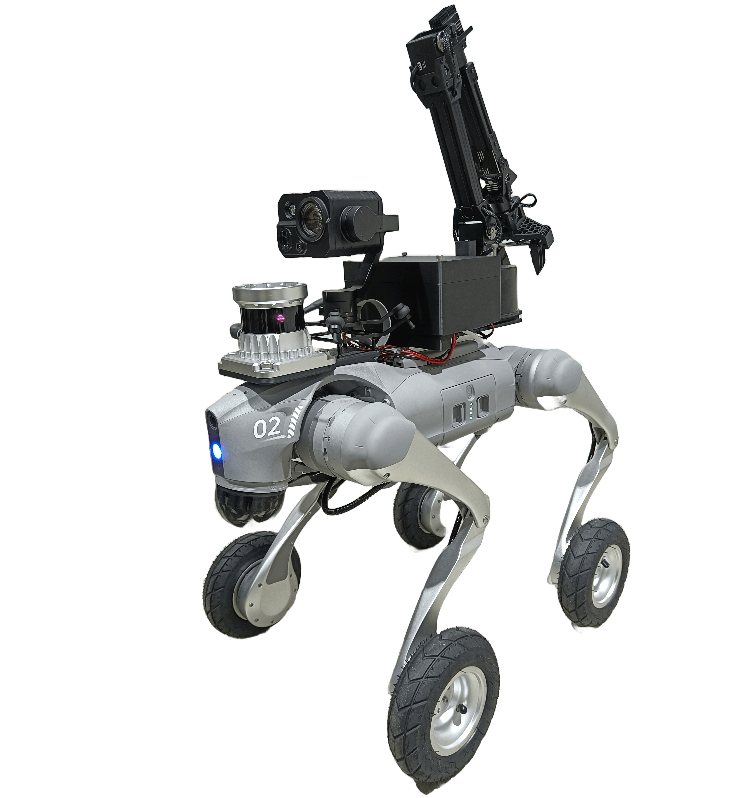
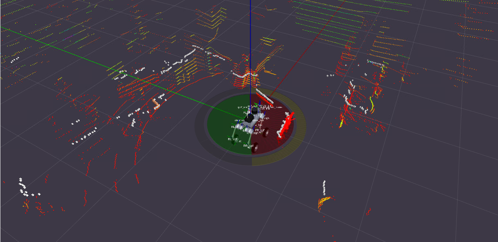
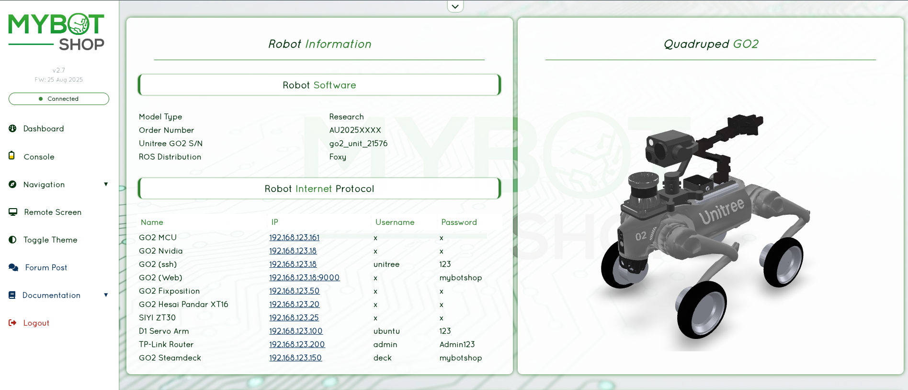
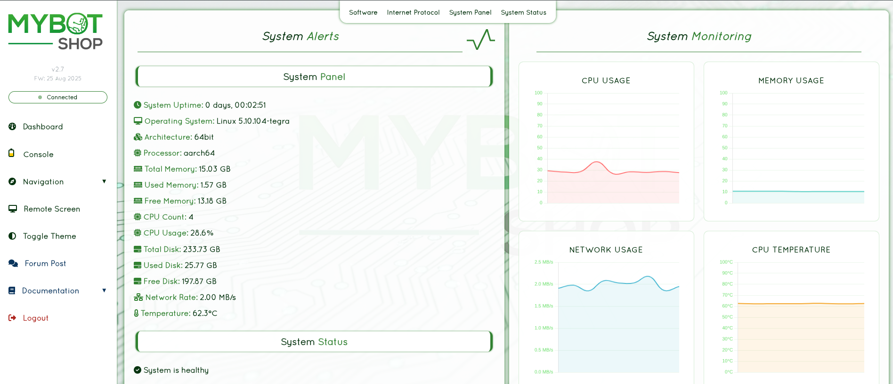
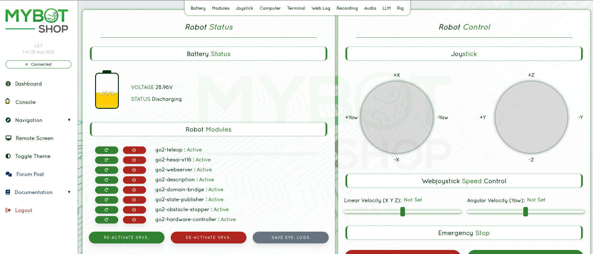
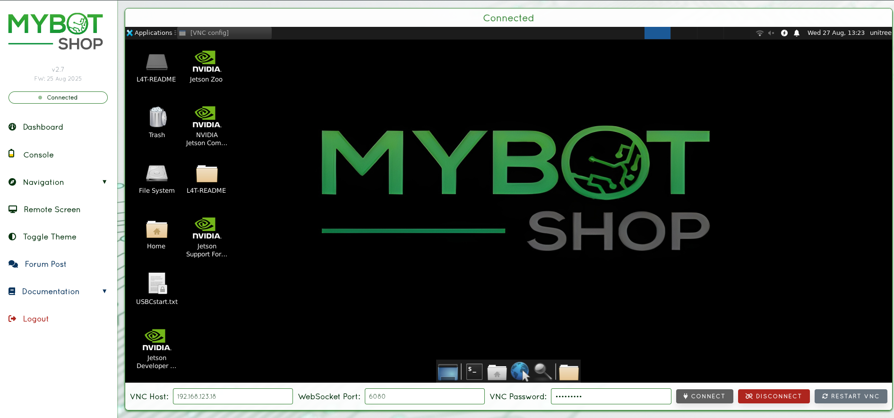
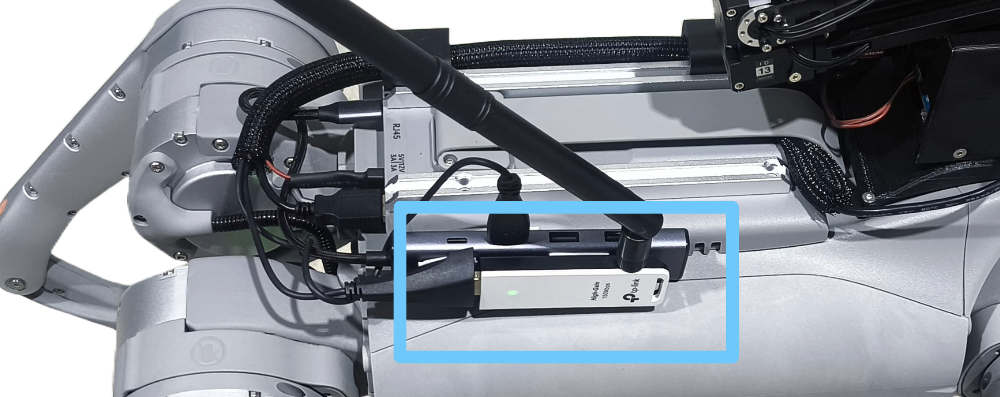

# QRE GO2|GO2-W v2.2.7


ROS2 Foxy driver and tools for the Unitree GO2/GO2-W Edu quadruped robot.

> **Pull requests are welcomed for updates/enhancements!**

---

> [!IMPORTANT]
> This `foxy-nvidia` branch is for the on-board computer of the GO2 Edu and is the **unstable development version**.
> Valid only for GO2 Edu (firmware V1.9+). Tested until 09-September-2025.

> [!WARNING]
> Unitree frequently updates firmware and naming conventions which **may** cause breakage. Submit an issue or pull request if you encounter problems.

---

**Resources:**
- [GO2 Quadruped Documentation](https://www.docs.quadruped.de/projects/go2/html/index.html) (slightly outdated)
- [View QUADRUPED GO2 v4.1 PDF](./src/mybotshop/v4.1.1_MBS_GO2_Booklet.pdf)



---

## Table of Contents

- [Quick Start](#quick-start)
- [Interfacing](#interfacing)
- [ROS2 Modules](#ros2-modules)
  - [Auto Startup](#auto-startup)
  - [Inbuilt Camera](#inbuilt-camera)
  - [Obstacle Avoidance](#lidar-based-obstacle-avoidance)
  - [Action Modes](#action-modes)
  - [Webserver](#webserver)
- [Sensors](#sensors)
  - [Thermal Cameras (ZT30)](#thermal-cameras)
  - [Depth Cameras (Realsense)](#depth-cameras)
  - [Lidars](#lidars)
  - [GPS](#gps)
- [Robotic Arms](#robotic-arms)
  - [D1 Arm](#d1)
  - [Open Manipulator](#open-manipulator-om)
- [Navigation](#navigation)
- [Steamdeck](#steamdeck)
- [Simulation](#simulation)
- [Installation](#installation)
- [Debugging](#debugging)
- [Miscellaneous](#miscellanious)
- [Enhancements](#enhancements)
- [Changelog](#changelog)

---

## Features

- [X] GO2/GO2W Base High Level Driver
    - [X] Joint State Publisher
    - [X] Odom Publisher
    - [X] Odom TF Publisher
    - [X] IMU Publisher
    - [X] Light Control - Needs reimplementation for v2.0.0
    - [X] Volume Control - Needs reimplementation for v2.0.0
    - [X] Gait Selection
- [X] GO2 Base Low Level Driver Example (see unitree SDK in third party)
- [X] GO2 Lidar (2D Scan requires further update)
- [X] GO2/GO2W Description
- [X] GO2 Camera
- [X] GO2 Bringup
- [X] GO2/GO2W Viz
- [X] GO2/GO2W Control
- [X] GO2/GO2W SLAM - Untested v2.0.0
- [X] GO2/GO2W Odom Navigation - Untested v2.0.0
- [X] GO2/GO2W Map Navigation - Untested v2.0.0
- [X] GO2 Isaac Sim
- [X] GO2 Gazebo
- [X] Auxiliary - Sensors - Realsense D435i
- [ ] Auxiliary - Sensors - Livox Mid360 - Needs reimplementation for v2.0.0
- [X] Auxiliary - Arm - Open Manipulator X
- [X] Auxiliary - Arm - D1

---

## Quick Start

**Key Configuration:**
- ROS Domain: `ROS_DOMAIN_ID=10`
- Namespace can be changed for multi-robot systems

---

## Interfacing

Instructions for interfacing with Ubuntu 20.04 and ROS2 Foxy.

> Complete setup and pairing with GO2 Edu via the app first. See [GO2 Docs](https://www.docs.quadruped.de/projects/go2/html/index.html).

### IP Addresses

| IP Address | Device | Username | Password |
|------------|--------|----------|----------|
| 192.168.123.161 | GO2 MCU | - | - |
| 192.168.123.18 | GO2 Auxiliary PC | unitree | 123 |
| 192.168.123.18:9000 | GO2 Webserver MBS | - | mybotshop |

> Other networks can cause disruptions. Keep only the robot connection active.

### Static Network Connection

For first-time connection via LAN cable:

1. Go to Settings → Network → click **+** to create new connection
2. Set IPv4 to **Manual**
3. Set Address: `192.168.123.51`, Netmask: `24`
4. Save and restart network

Verify connection:
```bash
ifconfig
ping 192.168.123.18
```

Access via SSH:
```bash
ssh -X unitree@192.168.123.18
# Password: 123
```

### Drivers Startup

Complete the installation and ROS2 packages will run in background if pre-installed by MYBOTSHOP.

> [!IMPORTANT]
> See [go2_bringup startup script](src/mybotshop/go2_bringup/scripts/startup_installer.py) for important packages.
> Service names can be referenced to launch files, e.g., `sudo service go2-webserver status` or `ros2 launch go2_webserver webserver.launch.py`.

### Gaits

| Gait | Command | Use Case |
|------|---------|----------|
| Classic Trot | `ROS_DOMAIN_ID=10 ros2 service call /$GO2_NS/modes go2_interface/srv/Go2Modes "{request_data: 'gait_type_classic'}"` | Nav2, SLAM |
| Flat Terrain | `ROS_DOMAIN_ID=10 ros2 service call /$GO2_NS/modes go2_interface/srv/Go2Modes "{request_data: 'gait_type_flat_terrain'}"` | Flat surfaces |
| Economic | `ROS_DOMAIN_ID=10 ros2 service call /$GO2_NS/modes go2_interface/srv/Go2Modes "{request_data: 'gait_type_economic'}"` | Battery conservation |
| Fast Trot | `ROS_DOMAIN_ID=10 ros2 service call /$GO2_NS/modes go2_interface/srv/Go2Modes "{request_data: 'gait_type_trot_run'}"` | Speed |
| A.I. Trot | `ROS_DOMAIN_ID=10 ros2 service call /$GO2_NS/modes go2_interface/srv/Go2Modes "{request_data: 'gait_type_agile'}"` | Agile movement |

### Visualization

```bash
ros2 launch go2_viz view_robot.launch.py
```

### Tele-operation

```bash
ROS_DOMAIN_ID=10 ros2 run teleop_twist_keyboard teleop_twist_keyboard --ros-args --remap cmd_vel:=/$GO2_NS/cmd_vel
```

---

## ROS2 Modules

### Auto Startup

Check if startup job is available:
```bash
sudo service go2-<ros2 module name> status
```

| Marker | Status |
|--------|--------|
| Red | Failed |
| Green | Working |
| Grey | Not started |

Restart a service:
```bash
sudo service go2-<ros2 module name> restart
```

Update startup job after modifying `startup_installer.py` in **go2_bringup**:
```bash
ros2 run go2_bringup startup_installer.py
```

### Inbuilt Camera

#### Camera Calibration

> Already provided. Requires 7x6 checkerboard.

```bash
ROS_DOMAIN_ID=10 ros2 run camera_calibration cameracalibrator --size 8x6 --square 0.025 --camera /go2_unit_001/sensor/camera
```

### Lidar Based Obstacle Avoidance



Enable:
```bash
ROS_DOMAIN_ID=10 ros2 service call /$GO2_NS/obstacle_avoidance_mode go2_interface/srv/Go2Modes '{request_data: enable}'
```

Disable:
```bash
ROS_DOMAIN_ID=10 ros2 service call /$GO2_NS/obstacle_avoidance_mode go2_interface/srv/Go2Modes '{request_data: disable}'
```

### Action Modes

**Available Modes:**
`balance_stand`, `recovery_stand`, `stand_down`, `stand_up`, `stretch`, `damp`, `sit`, `rise_sit`, `front_jump`, `front_pounce`, `front_flip`, `stop_move`

> These can be extended in `go2_platform` cpp file for newer firmware features.

**Available Functions:**
- Light level: 0-10
- Volume level: 0-10

**Examples:**

Stand up:
```bash
ROS_DOMAIN_ID=10 ros2 service call /go2_unit_001/modes go2_interface/srv/Go2Modes "{request_data: 'stand_up'}"
```

Balance stand (for movement):
```bash
ROS_DOMAIN_ID=10 ros2 service call /go2_unit_001/modes go2_interface/srv/Go2Modes "{request_data: 'balance_stand'}"
```

Stand down (first stand_up to remove balance mode, then stand_down - important for latest firmware and GO2-W):
```bash
ROS_DOMAIN_ID=10 ros2 service call /go2_unit_001/modes go2_interface/srv/Go2Modes "{request_data: 'stand_up'}"
ROS_DOMAIN_ID=10 ros2 service call /go2_unit_001/modes go2_interface/srv/Go2Modes "{request_data: 'stand_down'}"
```

Light level:
```bash
ROS_DOMAIN_ID=10 ros2 service call /$GO2_NS/light go2_interface/srv/Go2Light "{light_level: 10}"
```

Volume level:
```bash
ROS_DOMAIN_ID=10 ros2 service call /$GO2_NS/volume go2_interface/srv/Go2Volume "{volume_level: 4}"
```

> If a mode doesn't activate correctly (e.g., stand), use `recovery_stand`.

### Webserver

Pre-installed for heavy integration projects. Accessible at [http://192.168.123.18:9000/](http://192.168.123.18:9000/) or the WiFi IP.

Configure via: `/opt/mybotshop/src/mybotshop/go2_webserver/config/robot_webserver.yaml`

| Page | Description |
|------|-------------|
| **Login** | Disabled |
| **Dashboard** | Enable/Disable ROS2 Services, Record logs |
| **System** | View external PC status (battery requires ROS2 drivers enabled) |
| **Console** | Movement, Gait switching, ROS2 bag recording, Speaker access |
| **Remote Desktop** | On-board screen via VNC |
| **Navi Indoor** | Disabled |
| **Navi Outdoor** | Disabled |
| **LLM Interface** | Disabled |






---

## Sensors

### Thermal Cameras

#### ZT30

Gimbal velocity control:
```bash
ros2 topic pub /$GO2_NS/zt30/gimbal/control/cmd go2_interface/msg/CameraGimbalCmd '{yaw: 10, pitch: 0}'
```

**Camera Modes:**
| Mode | Description |
|------|-------------|
| 0 | Main: Wide, Sub: Zoom (Default) |
| 1 | HD Wide \| Thermal Zoom |
| 2 | HD Zoom \| HD Wide |
| 3 | HD Wide |
| 4 | HD Wide \| PIP (Wide Main, Zoom Sub) |
| 5 | HD Wide \| PIP (Zoom Main, Wide Sub) |
| 6 | HD Wide \| Dual-split (Wide & Zoom) |
| 7 | Thermal Zoom \| Thermal, Sub: Zoom |
| 8 | Main: Thermal, Sub: Wide |
| 9 | Thermal only |
| 10 | Dual-split (Thermal + Visible) |
| 11 | PIP (Thermal Main, Zoom Sub) |

Normal camera:
```bash
ros2 service call /$GO2_NS/zt30/camera_mode go2_interface/srv/CameraMode '{camera_mode: 0}'
```

Thermal:
```bash
ros2 service call /$GO2_NS/zt30/camera_mode go2_interface/srv/CameraMode '{camera_mode: 8}'
```

Take photo:
```bash
ros2 service call /$GO2_NS/zt30/trigger_photo std_srvs/srv/Trigger {}
```

Start/Stop recording:
```bash
ros2 service call /$GO2_NS/zt30/trigger_video std_srvs/srv/Trigger {}
```

Zoom in/out:
```bash
ros2 service call /$GO2_NS/zt30/zoomin_control std_srvs/srv/Trigger {}
ros2 service call /$GO2_NS/zt30/zoomout_control std_srvs/srv/Trigger {}
```

### Depth Cameras

> [!WARNING]
> If running both Realsense cameras, launch in separate terminals with 10s delay between each.

#### Realsense D405

```bash
ros2 launch go2_depth_camera realsense_d405.launch.py
```

#### Realsense D435i

```bash
ros2 launch go2_depth_camera realsense_d435i.launch.py
```

Both are off by default. Configure in `go2_depth_camera/launch/realsense_d4XX.launch.py`.

### Lidars

#### Livox Mid360

```bash
ros2 launch go2_lidars livox_mid360.launch.py
```

#### Hesai Pandar XT-16

```bash
ros2 launch go2_lidars hesai.launch.py
```

Configuration: Go to IP, set spin rate 1200, return mode strongest return, azimuth 30 to 330.

### GPS

#### Fixposition Setup

Install dependencies:
```bash
sudo apt update
sudo apt install libyaml-cpp-dev libboost-all-dev zlib1g-dev libeigen3-dev linux-libc-dev nlohmann-json3-dev
```

Build:
```bash
distrobox enter ros2_humble
rm /opt/mybotshop/src/third_party/gps/07Aug2025_fixposition_humble/COLCON_IGNORE
cp -r /opt/mybotshop/src/third_party/gps/07Aug2025_fixposition_humble /home/unitree/fixposition_humble
cd /home/unitree/fixposition_humble
source /opt/ros/humble/setup.bash
./setup_ros_ws.sh -r 2
./create_ros_ws.sh /home/unitree/fixposition_humble_ws
cd /home/unitree/fixposition_humble_ws
colcon build --symlink-install --cmake-args -DBUILD_TESTING=OFF && source install/setup.bash
```

Run:
```bash
distrobox enter ros2_humble
source /opt/ros/humble/setup.bash
source /home/unitree/fixposition_humble_ws/install/setup.bash
ros2 launch fixposition_driver_ros2 fixposition_humble.launch.py
```

Run converter (new terminal):
```bash
ros2 launch odom_to_tf_ros2 odom_to_tf.launch.py
```

---

## Robotic Arms

### D1

#### D1 Driver

```bash
ROS_DOMAIN_ID=10 ros2 launch d1_controller controller.launch.py
```

#### Enable/Disable Motors

```bash
ROS_DOMAIN_ID=10 ros2 service call /$GO2_NS/d1/enable_load std_srvs/srv/SetBool "{data: true}"
ROS_DOMAIN_ID=10 ros2 service call /$GO2_NS/d1/enable_load std_srvs/srv/SetBool "{data: false}"
```

#### D1 Trajectory Control

> All angles in radians except gripper.

| Joint | Description |
|-------|-------------|
| d1_link1_joint | Base rotation |
| d1_link5_joint | Gripper pitch |
| d1_link6_joint | Gripper roll |
| d1_link_l_joint | Gripper grasp (Max: 1.0, Min: -1.0) |

Home position:
```bash
ROS_DOMAIN_ID=10 ros2 action send_goal /$GO2_NS/d1/follow_joint_trajectory control_msgs/action/FollowJointTrajectory "
trajectory:
  joint_names: ['d1_link1_joint', 'd1_link2_joint', 'd1_link3_joint', 'd1_link4_joint', 'd1_link5_joint', 'd1_link6_joint', 'd1_link_l_joint']
  points:
  - positions: [0.0, -1.0, 1.047, 0.0, 0.0, 0.0, 1.0]
    time_from_start: {sec: 1, nanosec: 0}
"
```

Stand position:
```bash
ROS_DOMAIN_ID=10 ros2 action send_goal /$GO2_NS/d1/follow_joint_trajectory control_msgs/action/FollowJointTrajectory "
trajectory:
  joint_names: ['d1_link1_joint', 'd1_link2_joint', 'd1_link3_joint', 'd1_link4_joint', 'd1_link5_joint', 'd1_link6_joint', 'd1_link_l_joint']
  points:
  - positions: [0.0, 0.0, 0.0, 0.0, 0.0, 0.0, 1.0]
    time_from_start: {sec: 1, nanosec: 0}
"
```

Custom position:
```bash
ROS_DOMAIN_ID=10 ros2 action send_goal /$GO2_NS/d1/follow_joint_trajectory control_msgs/action/FollowJointTrajectory "
trajectory:
  joint_names: ['d1_link1_joint', 'd1_link2_joint', 'd1_link3_joint', 'd1_link4_joint', 'd1_link5_joint', 'd1_link6_joint', 'd1_link_l_joint']
  points:
  - positions: [0.0, -0.4, 1.4, 0.0, 0.0, 0.0, 1.0]
    time_from_start: {sec: 1, nanosec: 0}
"
```

### Open Manipulator (OM)

#### OM Driver

Start driver (must be running for moveit/trajectories):
```bash
ros2 launch go2_manipulation openmanipulator.launch.py
```

Launch moveit and state publisher:
```bash
ros2 launch go2_manipulation moveit2.launch.py
```

#### OM Commands

> Update namespace accordingly if applicable.

Test driver:
```bash
ROS_DOMAIN_ID=10 ros2 action send_goal /$GO2_NS/open_manipulator/joint_trajectory_controller/follow_joint_trajectory control_msgs/action/FollowJointTrajectory -f "{
  trajectory: {
    joint_names: [joint1, joint2, joint3, joint4],
    points: [
      { positions: [0.1, 0.1, 0.1, 0.1], time_from_start: { sec: 2 } },
      { positions: [-0.1, -0.1, -0.1, -0.1], time_from_start: { sec: 4 } },
      { positions: [0, 0, 0, 0], time_from_start: { sec: 6 } }
    ]
  }
}"
```

Home position (prior to 06 March 2025):
```bash
ROS_DOMAIN_ID=10 ros2 action send_goal /go2_unit_001/open_manipulator/joint_trajectory_controller/follow_joint_trajectory control_msgs/action/FollowJointTrajectory -f "{
  trajectory: {
    joint_names: [joint1, joint2, joint3, joint4],
    points: [
      { positions: [0.0, -1.4, 1.2, 1.2], time_from_start: { sec: 2 } },
    ]
  }
}"
```

Home position (after 06 March 2025):
```bash
ROS_DOMAIN_ID=10 ros2 action send_goal /$GO2_NS/open_manipulator/joint_trajectory_controller/follow_joint_trajectory control_msgs/action/FollowJointTrajectory -f "{
  trajectory: {
    joint_names: [joint1, joint2, joint3, joint4],
    points: [
      { positions: [0.0, -1.7, 1.4, 1.2], time_from_start: { sec: 2 } },
    ]
  }
}"
```

Stand position:
```bash
ROS_DOMAIN_ID=10 ros2 action send_goal /$GO2_NS/open_manipulator/joint_trajectory_controller/follow_joint_trajectory control_msgs/action/FollowJointTrajectory -f "{
  trajectory: {
    joint_names: [joint1, joint2, joint3, joint4],
    points: [
      { positions: [0.0, -0.2, -0.1, -0.24], time_from_start: { sec: 1 } },
    ]
  }
}"
```

Close gripper (must be done when turning off):
```bash
ROS_DOMAIN_ID=10 ros2 action send_goal /$GO2_NS/open_manipulator/gripper_controller/follow_joint_trajectory control_msgs/action/FollowJointTrajectory -f "{
  trajectory: {
    joint_names: [gripper],
    points: [
      { positions: [1.0], time_from_start: { sec: 2 } },
    ]
  }
}"
```

Open gripper:
```bash
ROS_DOMAIN_ID=10 ros2 action send_goal /$GO2_NS/open_manipulator/gripper_controller/follow_joint_trajectory control_msgs/action/FollowJointTrajectory -f "{
  trajectory: {
    joint_names: [gripper],
    points: [
      { positions: [-1.0], time_from_start: { sec: 2 } },
    ]
  }
}"
```

#### Open Manipulator X (Independent)

Independent launch:
```bash
ros2 launch open_manipulator_x_controller open_manipulator_x_controller.launch.py
```

Teleop:
```bash
ros2 run open_manipulator_x_teleop teleop_keyboard
```

---

## Navigation

### SLAM

> [!WARNING]
> Yet to be ported to the new system.

Ensure **go2_bringup** is running:
```bash
ros2 launch go2_navigation slam.launch.py
```

Map using teleop at **0.2m/s**. Export map:
```bash
ROS_DOMAIN_ID=10 ros2 run nav2_map_server map_saver_cli -f /opt/mybotshop/src/mybotshop/go2_navigation/maps/custom_map
```

Rebuild (required if map name is not `map_`):
```bash
cd /opt/mybotshop/ && colcon build --symlink-install && source /opt/mybotshop/install/setup.bash
```

### Odometric Navigation

> Nav2 goal tool + Nav2 goal plugin doesn't work due to namespace. Use 2D Goal Pose and/or scripts.

```bash
ros2 launch go2_navigation odom_navi.launch.py
```

### Map Navigation

> Nav2 goal tool + Nav2 goal plugin doesn't work due to namespace. Use 2D Goal Pose and/or scripts.

Ensure map is generated and available:
```bash
ros2 launch go2_navigation map_navi.launch.py
```

---

## Steamdeck

1. Follow [Steamdeck Instructions](https://www.docs.mybotshop.de/projects/product_steamdeck/html/steamdeck_initialization.html)

2. Connect to GO2's custom router (may take a few minutes on startup)

| Device | IP |
|--------|-----|
| Steamdeck | 192.168.123.150 |
| Router | 192.168.123.100 |
| Unitree GO2 | 192.168.123.18 |

3. Hold **L1** and use joysticks to move. Change gaits via webserver console tab.

4. Browser auto-opens to `192.168.123.18:9000`

5. Drivers are off by default. Click "restart all" in dashboard to enable ROS2 services.

6. Add services in `/opt/mybotshop/src/mybotshop/go2_webserver/go2_webserver/libroscustom.py`

---

## Simulation

### Isaac Sim

> Instructions in `humble` branch: [qre-go2-humble](https://github.com/MYBOTSHOP/qre_go2/tree/humble)

### Gazebo (ROS2 Humble)

Update `robot.xacro` with gazebo extension controllers.

#### GO2 Gazebo

```bash
ros2 launch go2_gazebo go2_fortress_simulation.launch.py
```

#### GO2W Gazebo

Update `accessories.xacro` with wheels:
```bash
ros2 launch go2_gazebo go2_fortress_simulation.launch.py
```

#### Effort Trajectory Control Example

```bash
ros2 action send_goal /joint_effort_controller/follow_joint_trajectory control_msgs/action/FollowJointTrajectory -f "{
  trajectory: {
    joint_names: [
      'FL_hip_joint', 'FL_thigh_joint', 'FL_calf_joint',
      'FR_hip_joint', 'FR_thigh_joint', 'FR_calf_joint',
      'RL_hip_joint', 'RL_thigh_joint', 'RL_calf_joint',
      'RR_hip_joint', 'RR_thigh_joint', 'RR_calf_joint'
    ],
    points: [
      {
        positions: [0.0, 0.9, -1.5, 0.0, 0.9, -1.5, 0.0, 0.9, -1.5, 0.0, 0.9, -1.5],
        time_from_start: {sec: 2, nanosec: 0}
      }
    ]
  }
}"
```

#### GO2W Wheeled Example

Move forward:
```bash
ros2 topic pub /velocity_controller/commands std_msgs/msg/Float64MultiArray "{data: [-1.0, -1.0, -1.0, -1.0]}"
```

Move backward:
```bash
ros2 topic pub /velocity_controller/commands std_msgs/msg/Float64MultiArray "{data: [10.0, 10.0, 10.0, 10.0]}"
```

Stop:
```bash
ros2 topic pub /velocity_controller/commands std_msgs/msg/Float64MultiArray "{data: [0.0, 0.0, 0.0, 0.0]}"
```

#### Effort Control Example (Disabled)

Joints: `FL_hip_joint`, `FL_thigh_joint`, `FL_calf_joint`, `FR_hip_joint`, `FR_thigh_joint`, `FR_calf_joint`, `RL_hip_joint`, `RL_thigh_joint`, `RL_calf_joint`, `RR_hip_joint`, `RR_thigh_joint`, `RR_calf_joint`

Move joints:
```bash
ros2 topic pub -1 /joint_effort_controller/commands std_msgs/msg/Float64MultiArray "{
    data: [-10.0, -30.0, 70.0, 10.0, -30.0, 70.0, -10.0, -30.0, 70.0, 10.0, -30.0, 70.0]
}"
```

Zero effort:
```bash
ros2 topic pub -1 /joint_effort_controller/commands std_msgs/msg/Float64MultiArray "{
    data: [0.0, 0.0, 0.0, 0.0, 0.0, 0.0, 0.0, 0.0, 0.0, 0.0, 0.0, 0.0]
}"
```

#### Position Control Open Manipulator X

```bash
ros2 action send_goal /joint_position_controller/follow_joint_trajectory control_msgs/action/FollowJointTrajectory -f "{
  trajectory: {
    joint_names: [joint1, joint2, joint3, joint4, gripper],
    points: [
      { positions: [0.0, -1.57, 1.57, 0.5, 0.0], time_from_start: { sec: 1 } },
    ]
  }
}"
```

#### Cleanup Gazebo

```bash
ros2 run go2_gazebo kill_gz.sh
```

# Reiforcement Learning

## 1. RL SAR
[rl_sar](https://github.com/fan-ziqi/rl_sar)

| Feature         | Details                                       |
|-----------------|-----------------------------------------------|
| Repo            | https://github.com/fan-ziqi/rl_sar            |
| GO2W Support    | Yes, explicit support with pre-trained policy |
| Simulation      | Gazebo, MuJoCo                                |
| Real Deployment | Yes, via Ethernet                             |

### Setup

Clone and setup (amdx64):
```bash
sudo apt install cmake g++ build-essential libyaml-cpp-dev libeigen3-dev libboost-all-dev liblcm-dev
git clone https://github.com/fan-ziqi/rl_sar.git && cd rl_sar 
git submodule update --init --recursive
./build.sh
```

On go2w robot jetson:

```bash
sudo apt install cmake g++ build-essential libyaml-cpp-dev libeigen3-dev libboost-all-dev liblcm-dev
cd /opt/mybotshop/src/third_party/reinforcement_learning/rl_sar
./build.sh
```

### Deployment

Run GO2W simulation:

```bash
source /usr/share/gazebo-11/setup.sh
source install/setup.bash
ros2 launch rl_sar gazebo.launch.py rname:=go2w
```

```bash
source install/setup.bash
ros2 run rl_sar rl_sim --ros-args -p robot_name:=go2w
```

Deploy on real GO2W:
```bash
cd /opt/mybotshop/src/third_party/reinforcement_learning/rl_sar/
```
```bash
./cmake_build/bin/rl_real_go2 eth0 wheel
```

### Control with Gamepad or Keyboard

#### Basic Controls

| Gamepad | Keyboard | Description |
|---------|----------|-------------|
| A | Num0 | Move robot from initial pose to `default_dof_pos` (position control interpolation) |
| B | Num9 | Move robot from current position to initial pose |
| X | N | Toggle navigation mode (disables velocity commands, receives `cmd_vel` topic) |
| Y | N/A | N/A |

#### Simulation Controls

| Gamepad | Keyboard | Description |
|---------|----------|-------------|
| RB+Y | R | Reset Gazebo environment (stand up fallen robot) |
| RB+X | Enter | Toggle Gazebo run/stop (default: running) |

#### Motor Controls

| Gamepad | Keyboard | Description |
|---------|----------|-------------|
| LB+A | M | Motor enable (recommended) |
| LB+B | K | Motor disable (recommended) |
| LB+X | P | Motor passive mode (kp=0, kd=8) |
| LB+RB | N/A | Emergency stop (recommended) |

#### Skill Selection

| Gamepad | Keyboard | Description |
|---------|----------|-------------|
| RB+DPad Up | Num1 | Basic Locomotion |
| RB+DPad Down | Num2 | Skill 2 |
| RB+DPad Left | Num3 | Skill 3 |
| RB+DPad Right | Num4 | Skill 4 |
| LB+DPad Up | Num5 | Skill 5 |
| LB+DPad Down | Num6 | Skill 6 |
| LB+DPad Left | Num7 | Skill 7 |
| LB+DPad Right | Num8 | Skill 8 |

#### Movement Controls

| Gamepad | Keyboard | Description |
|---------|----------|-------------|
| Left Stick Y | W/S | Forward/Backward (X-axis) |
| Left Stick X | A/D | Left/Right strafe (Y-axis) |
| Right Stick X | Q/E | Yaw rotation |
| Release joystick | Space | Reset all commands to zero |


---

## Installation

### NVIDIA Orin NX Developer Kit (Inbuilt GO2 EDU)

**1. Set hostname:**
```bash
# Switch Go2 ID with ctrl+h: go2_unit_49702
sudo hostnamectl set-hostname go2-unit-49702
```

**2. Activate WiFi:**
```bash
sudo nmtui
```

**3. Update date and time:**
```bash
sudo timedatectl set-timezone Europe/Berlin
sudo date -s "$(wget --method=HEAD -qSO- --max-redirect=0 google.com 2>&1 | sed -n 's/^ *Date: *//p')"
```

**4. Fix apt issues:**
```bash
sudo apt-key del F42ED6FBAB17C654
curl -sSL https://raw.githubusercontent.com/ros/rosdistro/master/ros.asc | sudo apt-key add -
sudo apt-get update
```

**5. Update to international foxy packages:**
```bash
sudo sed -i 's|mirrors.tuna.tsinghua.edu.cn/ros2/ubuntu|packages.ros.org/ros2/ubuntu|g' /etc/apt/sources.list.d/ros-fish.list
sudo apt update
```

**6. Create workspace:**
```bash
sudo mkdir /opt/mybotshop
sudo chown -R unitree:unitree /opt/mybotshop
```

**7. Clone and install:**
```bash
cd /opt/mybotshop/src/mybotshop/ && sudo chmod +x go2_install.sh && ./go2_install.sh
cd /opt/mybotshop/src/mybotshop/go2_webserver && sudo chmod +x webserver_installer.sh && ./webserver_installer.sh
```

**If you get apt errors:**

Edit ROS2 sources:
```bash
sudo nano /etc/apt/sources.list.d/ros2.list
```

Replace contents with:
```bash
deb [trusted=yes] http://packages.ros.org/ros2/ubuntu focal main
```

Then:
```bash
sudo apt update
```

**8. Set VNC password:**
```bash
vncpasswd ~/.vnc/passwd
# Password: mybotshop
# View-only: mybotshop
```

**9. Build Unitree SDK:**
```bash
cp -r /opt/mybotshop/src/third_party/unitree/04Aug2025_unitree_sdk2/ /opt/mybotshop
mkdir /opt/mybotshop/04Aug2025_unitree_sdk2/build
cd /opt/mybotshop/04Aug2025_unitree_sdk2/build
cmake .. && make && sudo make install
```

**10. Build ROS2 workspace:**
```bash
cd /opt/mybotshop && colcon build --symlink-install && source install/setup.bash
```

**11. Update .bashrc:**
```bash
# MYBOTSHOP
source ~/cyclonedds_ws/install/setup.bash
export RMW_IMPLEMENTATION=rmw_cyclonedds_cpp
export CYCLONEDDS_URI=~/cyclonedds_ws/cyclonedds.xml
export PATH=/usr/local/cuda-11.4/bin:$PATH
export LD_LIBRARY_PATH=/usr/local/cuda-11.4/lib64:$LD_LIBRARY_PATH

source /opt/ros/foxy/setup.bash
source /opt/mybotshop/install/setup.bash
```

**12. Run startup installer:**
```bash
ros2 run go2_bringup startup_installer.py
```

**13. Enable fast webserver:**
```bash
cd /opt/mybotshop/src/mybotshop/go2_webserver/go2_webserver/ && rm -rf librosnode.py libaudiogen.py libwebserver.py
```

**14. Install Unitree Python SDK2 (for low-level control):**
```bash
cd && git clone https://github.com/eclipse-cyclonedds/cyclonedds -b releases/0.10.x
cd cyclonedds && mkdir build install && cd build
cmake .. -DCMAKE_INSTALL_PREFIX=../install
cmake --build . --target install
```

```bash
export CYCLONEDDS_HOME="/home/unitree/cyclonedds/install"
cd /opt/mybotshop/src/third_party/unitree/20Jan2026_unitree_sdk2_python/
pip3 install -e .
```

**15. Test low-level control:**
```bash
cd /opt/mybotshop/src/mybotshop/go2w_actuator_control/scripts && python3 go2w_stand_sit.py eth0
```

**16. Hesai attachment:**
- Go to 192.168.123.20
- Set spin rate 300
- Set return mode strongest return
- Set azimuth 30 to 330

**17. OpenManipulator:**
```bash
udevadm info --name=/dev/ttyUSB0 --attribute-walk
# Change udev serial to match
```

**18. Add D1 arm SDK:**
```bash
cp -r /opt/mybotshop/src/third_party/unitree/06Aug2025_d1_sdk/ /opt/mybotshop
cd /opt/mybotshop/06Aug2025_d1_sdk/build
cmake .. && make && sudo make install
```

### Host PC

> [!IMPORTANT]
> `foxy` branch is required for host PC, this branch will not work.

Build required packages (go2_viz, go2_description, etc.):
```bash
u20
source /opt/ros/foxy/setup.bash
source install/setup.bash
export ROS_DOMAIN_ID=10
export GO2_NS=go2_unit_49702
unset RMW_IMPLEMENTATION
ros2 launch go2_viz view_robot.launch.py
```

---

## Debugging

### RQT

```bash
ROS_DOMAIN_ID=10 ros2 run rqt_gui rqt_gui --ros-args --remap tf:=/$GO2_NS/tf --ros-args --remap tf_static:=/$GO2_NS/tf_static
```

### Dynamic Reconfigure

From configure, select Dynamic Reconfigure:
```bash
ROS_DOMAIN_ID=10 ros2 run rqt_gui rqt_gui --ros-args --remap tf:=/$GO2_NS/tf --ros-args --remap tf_static:=/$GO2_NS/tf_static
```

### TF

```bash
ROS_DOMAIN_ID=10 ros2 run rqt_tf_tree rqt_tf_tree --force-discover --ros-args --remap tf:=/$GO2_NS/tf --ros-args --remap tf_static:=/$GO2_NS/tf_static
```

```bash
ROS_DOMAIN_ID=10 ros2 run tf2_tools view_frames.py --force-discover --ros-args --remap tf:=/$GO2_NS/tf --ros-args --remap tf_static:=/$GO2_NS/tf_static
```

---

## Miscellanious

### Internet Via LAN

Connect GO2 to router with internet via LAN:
```bash
sudo ip link set eth0 down && sudo ip link set eth0 up
sudo dhclient eth0
```

Wait ~10-30 seconds, then:
```bash
sudo apt-get update
sudo date -s "$(wget --method=HEAD -qSO- --max-redirect=0 google.com 2>&1 | sed -n 's/^ *Date: *//p')"
```

### Fix GO2 USB 2.0 to 3.0 Port (2024 Models)

1. Backup device tree:
```bash
sudo cp /boot/dtb/kernel_tegra234-p3767-0000-p3768-0000-a0.dtb kernel_tegra234-p3767-0000-p3768-0000-a0.dtb.bak
```

2. Download latest device tree: https://oss-global-cdn.unitree.com/static/95bdc29bcc664325b5e1373d5512294a.zip

3. Replace:
```bash
sudo cp kernel_tegra234-p3767-0000-p3768-0000-a0.dtb /boot/dtb/ -r
```

4. Restart system.

### Sync Host Computer and Unitree

```bash
rsync -avP -t --delete -e ssh src unitree@192.168.123.18://opt/mybotshop
```

### Sync Host Computer and Steamdeck

```bash
rsync -avP -t --delete -e ssh src deck@192.168.123.150://home/deck/ros2_ws
```

### Camera Stream via Terminal (Non-ROS)

Replace `multicast-iface` with your port (e.g., eth0):
```bash
gst-launch-1.0 udpsrc address=230.1.1.1 port=1720 multicast-iface=eth0 ! application/x-rtp, media=video, encoding-name=H264 ! rtph264depay ! h264parse ! avdec_h264 ! videoconvert ! autovideosink
```

Faster version:
```bash
gst-launch-1.0 udpsrc address=230.1.1.1 port=1720 multicast-iface=eth0 ! \
    application/x-rtp, media=video, encoding-name=H264 ! \
    rtph264depay ! queue max-size-buffers=1 ! h264parse ! queue ! avdec_h264 ! \
    videoconvert ! autovideosink
```

---

## Enhancements

### WiFi Stick

Recommended: **TL-WN722N** with long-range antenna (budget friendly) or any high-end WiFi stick for remote operation.



### Connection Hub

Recommended: **Ugreen USB-C Hub** with HDMI port for testing/debugging and extra ports.

### Latest Updates

> [!IMPORTANT]
> Get updates from [qre_go2](https://github.com/MYBOTSHOP/qre_go2). For access, email support@mybotshop.de with your **GitHub Username** and **Purchase ID**.

---

## Changelog

<details>
<summary>Click to expand version history</summary>

### v2.2.7 | 20 Jan 2026
- Only for GO2 firmware V1.9+
1. Update to latest webserver

### v2.2.6 | 03 Sep 2025
- Only for GO2 firmware V1.9+
1. Add multi joint-state-publisher source
2. Update camera image to have compressed images
3. Add ZT30 model
4. Add Ouster model
5. Update webserver to v2.8 for video stream on web
6. Update ZT30 driver with joint states
7. Update rtsp stream with streamer and compressed images
8. Add rough d1 urdf
9. Add cad exported d1 urdf
10. Add controller for d1 arm
11. Restructure main readme
12. Add d1 to motd

### v2.2.5 | 04 August 2025
- Only for GO2 firmware V1.9+
1. New updated Go2 Webserver
2. Ouster Foxy support
3. ZT30 support
4. Steamdeck cover xacro
5. D1 integration support (Work in progress)
6. Tune Hesai PCD
7. Add Stop + Slow Zone with 3D PCD

### v2.2.4 | 04 August 2025
- Only for GO2 firmware V1.9+
1. GO2W standup standdown working with latest SDK2
2. Updated Web Gui
3. Change to Sitdown routine for compatibility with GO2-w

### v2.2.3 | 08 July 2025
- Only for GO2 firmware V1.9+
1. Add Unitree SDK 2.0.2
2. Add new gait types
3. Release updated webserver

### v2.2.0 | 12 June 2025
- Only for GO2 firmware V1.9+
1. Add Unitree SDK 2.0
2. Refactor ROS2 High level control for compatibility with Unitree SDK2.0
3. Add GO2-W model
4. Verify `cmd_vel` is usable with GO2-W
5. GO2-W motion-switcher unavailable will be added in new firmware update
6. Alternative method for joint state publisher
7. GO2W can be activated by switching `GO2_WHEELED` env variable from 0 to 1 in `go2_description/launch/go2_description.launch.py`

### v2.1.5 | 11 June 2025
1. Refactor repository folders
2. All folders now located in `/opt/mybotshop`
3. Renamed `go2_srvs` to `go2_interface`
4. Operational `Nav2` w/o multi robot system
5. Add Hesai Lidar Support
6. Fix hesai pandar xt16 bugs

### v2.0.0 | 20 Mar 2025
1. Multi-robot system on DOMAIN ID 10
2. Works with WiFi on DOMAIN ID 10 (requires srvs/msgs/actions built on your PC)
3. Webserver released at port 9000 (e.g., http://192.168.123.18:9000/)
4. On **40Tops**: all wrappers may use 100% CPU. Recommend **100 Tops** or disable unrequired components.

### v1.5.0 | 01 Jan 2024
1. In 2025, Unitree updated firmware requiring GO2 to be in sports_mode before control. Use v2.0.0 auto-switch or mobile app to switch from **A.I mode** to **General mode**.

</details>
